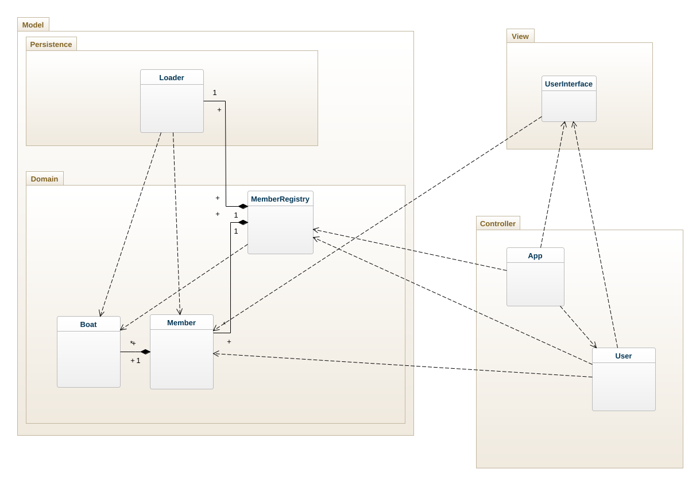

# Boatclub OO-Design
This document describes the design according to the requirements presented in assignment 2.

## Architectural Overview
The application uses the model-view-controller (MVC) architectural pattern. The view is passive and gets called from the controller. The view may only read information from the model, not directly change it.

## Detailed Design
### Class Diagram

This class diagram shows all relations between the classes. 
The boat class has a composition relation to the member class, because a boat cannot exist without being assigned to a member, but it is possible for a member to have no registered boats.
### Sequence Diagram

This sequence diagram shows how a member is added to the boat club registry.